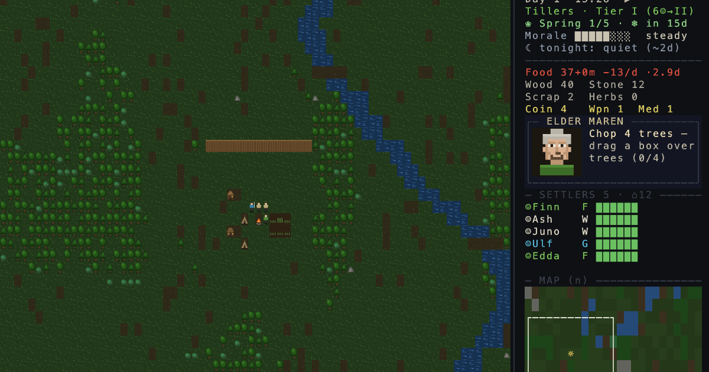

# HEARTHFALL

**Play it live: <https://hearthfall.vercel.app>**

A commune-survival roguelike in the browser — Dwarf Fortress bones,
State of Decay community pressure, Fallout 4 base building, and a
death-feeds-the-next-run legacy loop. No dependencies, no build step: plain
ES modules rendered to a canvas character grid.

New players are guided in by **the Elder** — one voice in the sidebar
that speaks the tutorial objectives, fires one-time tips at key moments,
and afterwards always names the commune's most pressing problem (their
face turns from calm to worried to alarmed as trouble nears). The
sidebar forecasts everything that matters: what tonight brings (raid
size included), how many days the food lasts, when the next wanderer
arrives and what's blocking them, and why morale sits where it does
(click the bar). Structures show their scars and workers repair them
for a trickle of material — nothing rots invisibly.

Two graphics modes, toggled with `v` (or from the main menu, persisted):
**Tiles** — procedurally drawn pixel-art sprites with animated water and
fire, day/night lighting, and campfire glow — and **ASCII** — the classic
character-grid look. Full **controller support** via the Gamepad API.



## Run it locally

```sh
pnpm install
pnpm dev        # vite, defaults to http://localhost:8137
```

npm works too (`npm install && npm run dev`). Node 20+. Other scripts:
`pnpm build` (production bundle), `pnpm lint`, `pnpm check` (typecheck via
JSDoc + tsc). No frameworks, no runtime dependencies — plain ES modules
drawn onto one canvas.

## The loop

Pick a people, run the commune, survive as long as you can. When it falls —
and it will — the run is scored (days survived, raids repelled, sites
cleared, kills, peak population, plus named feats: winters endured, hordes
broken, warlords slain) and paid out as **legacy ◆**, spent on permanent
perks that make every future run start stronger. Runs autosave at dawn;
death deletes the save. That's the deal. Or: reach tier III, raise **the
Beacon**, and hold for 3 days against everything it attracts — the only
way a run ends in victory.

**Seasons** turn every 5 days. In winter crops stop, bushes sleep, and
hunger bites harder — stockpile in autumn, fish the river (`g` on water),
or buy dear from the trader. **Morale** rises with victories and hot meals,
falls with deaths, theft and rough sleeping; a breaking commune bleeds
deserters into the night.

**Settlers** each carry a trait — brave, craven, glutton, keen-eye, night
owl and more — that bends how they work and fight. Settlers felled in
battle have an even chance to go down wounded instead of dying: helpless
where they fall, crawling for shelter, one blow from the end.

**Civs**: the Tillers (faster crops, extra farmer), the Wardens
(harder-hitting guards, extra guard), the Ratcatchers (faster, stronger
expeditions — unlocked by clearing sites), the Masons (faster construction,
tougher walls — unlocked by repelling raids).

**Legacy perks** (10, some tiered): starting stockpiles, permanent
crop/wall bonuses, trader discounts, extra starting settler, pre-scouted
world sites, stouter morale, +25% legacy income.

## How to play

| Key | Action |
| --- | --- |
| `b` | build menu, tabbed (`←`/`→`): **HOMES** tents/cabins/longhouses · **FOOD** farms, campfire, kitchen · **DEFENSE** walls, door, traps, watch post · **WORKS** workshop, the Beacon |
| click a workshop | production orders — queue spears and medkits, cancel for a refund |
| drag on the map | select an area, then pick from the orders menu: chop trees ♠ · mine rocks ▲ · forage bushes `"` · fish water ≈ · clear marks |
| `x` | demolish / cancel single plans |
| `r` | ring the alarm bell — civilians run for the fire, guards stand to their posts (all-clear at dawn) |
| `w` | world map — send one settler to scout a site, or a party to take it |
| `e` | trade with the visiting caravan (arrives every few days) |
| `Esc` | pause menu — resume, save, settings, how-to-play, quit (also closes whatever's open) |
| `space` | pause · `1/2/3` game speed · `?` help |
| `v` | toggle graphics: pixel tiles / classic ASCII |
| `Q` | save & quit to the main menu |
| click | a settler's name (sidebar or map) cycles their role |
| arrows | move the map cursor · `Enter` acts at the cursor (full keyboard play) |

**Controller** (standard layout): stick/d-pad moves the cursor and
navigates every menu · A confirm/act (hold to drag-paint) · B back ·
X build menu · Y world map · LB/RB cycle tools · LT/RT game speed ·
L3 alarm bell · Start pause · Back help · R3 graphics toggle.

**Roles.** Workers build/chop/mine/craft, farmers farm/cook/forage/fish,
guards only fight. Settlers handle eating, sleeping and firefighting
themselves.

**Economy.** Crops → raw food → kitchen **meals** (more filling). The
workshop takes production orders — click it to queue **spears** (wood +
scrap) and **medkits** (herbs). The trader converts surplus into **coin**
and coin into anything else (food runs dear in winter). Fishing spots
yield a steady trickle and rest between catches.

**Homes.** Settlers sleep *inside* houses: tents ∩ sleep 2, cabins Λ
sleep 3 (tier II), longhouses Π sleep 5 (tier III, best rest). No roof
means sleeping rough — slow recovery and sinking morale. Houses are wood;
torch-bearers love them.

**Progression.** 6 settlers unlock tier II (watch post, workshop, kitchen,
cabins); 9 unlock tier III (stone walls, longhouses, the Beacon).
Wanderers only join if there is food on the fire *and* room in the
houses. Guards within reach of a watch post shoot arrows at raiders
instead of chasing them.

**Raids** come at dusk every few days, scaling with survival time — and
past day 14 they may hit from two sides at once. Plain raiders ☻ chase your
people; **brutes** Ø smash walls; **skirmishers** § slip through open gaps
to rob your stockpile; **torch-bearers** ¡ set wooden structures alight
(stone doesn't burn — settlers douse fires once the fighting stops). Every
12th day a **horde** marches behind a named **warlord** ☠ — kill him and
the rest break. Clearing a bandit camp on the world map delays the next
raid; a camp left standing grows bolder and feeds bigger raids.

## Code map

- `js/game.js` — the sim: state, time, seasons, morale, pathfinding, settler/raider AI, economy, the Elder's counsel, save/load
- `js/world.js` — overworld generation, scouting, expeditions
- `js/meta.js` — persistent legacy points, perks, lifetime records
- `js/screens.js` — every screen and modal, declarative widgets over the cell buffer
- `js/mapdraw.js` — the classic ASCII world renderer + shared map UI helpers
- `js/tiles.js` — the sprite mode: procedural pixel-art atlas + lighting
- `js/gfx.js` — the compositor: one character-cell buffer over a canvas
- `js/portrait.js` — pixel-art elder portraits for the advisor window
- `js/mobile.js` — the phone landing page, drawn with the game's own art
- `js/gamepad.js` — Gamepad API polling mapped onto the shared key handler
- `js/ui.js` / `js/main.js` — screen stack, input routing, fixed-step loop
- `js/map.js`, `js/data.js`, `js/rng.js` — mapgen, content tables, RNG

Debug console: `G` is the game state, `ff(minutes)` fast-forwards the sim,
`GAME`/`WORLD`/`META_M` expose the modules.

## Contributing & license

MIT — see [LICENSE](LICENSE). Issues and PRs welcome; keep changes small
and playtest with `ff()` before opening one.
